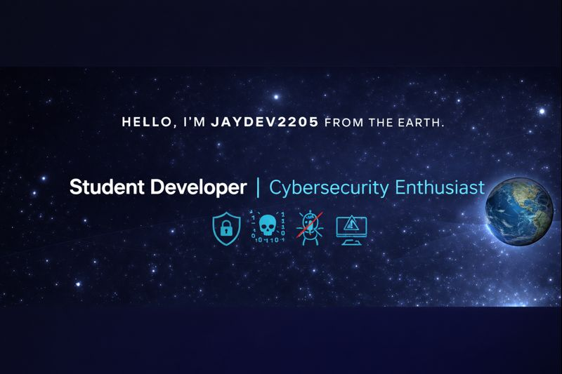

<!-- BANNER -->
<p align="center">
  
</p>

<br />

<!-- INTRO TEXT -->
<h1 align="center">HELLO, I'M JAYDEV2205 FROM THE EARTH 🌍</h1>

<h3 align="center">
  Student Developer | Cybersecurity Enthusiast
</h3>

<p align="center">
  🛡️ 🔐 🐛 ⚠️
</p>

<br />

<div align="center">

[](https://jaydev2205.click/)
[](https://github.com/Jaytran2205)
[](https://www.facebook.com/jaytran0522)
[](https://www.instagram.com/ismtran_22/)
[](mailto:jaytran2205@gmail.com)

</div>

---

## 👋 About Me

<div align="center">

```python
class Developer:
    def __init__(self):
        self.name = "Trần Ngọc Sơn"
        self.username = "Jaytran2205"
        self.role = "Student Developer & Security Researcher"
        self.location = "Vietnam 🇻🇳"
        self.website = "https://jaydev2205.click"
        
    def get_skills(self):
        return {
            "programming": ["Python", "JavaScript", "Java", "C++"],
            "security": ["Penetration Testing", "Vulnerability Assessment", 
                        "Network Security", "Cryptography"],
            "web_dev": ["React", "Node.js", "Full Stack Development"]
        }
    
    def get_interests(self):
        return [
            "🔒 Đam mê tìm hiểu về Cybersecurity",
            "🛡️ Quan tâm đến Information Security",
            "🌐 Học về Web Security cơ bản",
            "💻 Thích nghiên cứu về Ethical Hacking",
            "📚 Đang học và phát triển kỹ năng"
        ]
    
    def current_focus(self):
        return "Học lập trình và tìm hiểu về bảo mật thông tin"
    
    def repositories(self):
        return 48
    
    def motto(self):
        return "Security is not a feature, it's a foundation 🛡️"
```

**🛡️ Đam mê tìm hiểu về cybersecurity và bảo mật thông tin. Đang học và phát triển kỹ năng mỗi ngày!**

</div>

---

## 🛠️ Tech Stack

<div align="center">

### Languages


### Frontend


### Backend


### Databases


### Security & Tools


### Security Interests


</div>

---
## 📊 Quick Statistics

<div align="center">

| 📚 Repositories | 💻 Languages | 🛠️ Tools | 🔒 Focus |
|---|---|---|---|
| 48+ | 5+ | 20+ | Security |

</div>

<div align="center">

**🎯 Building secure applications** • **💡 Learning cybersecurity** • **🚀 Open source contributor**

</div>

---
## �🔒 Security Interests & Learning

<div align="center">

<table>
<tr>
<td width="50%" align="center">

### 🛡️ Đang Tìm Hiểu
- **Web Security Basics**
  - Tìm hiểu về các lỗ hổng web phổ biến
  - Học về XSS, SQL Injection cơ bản
  - Bảo mật ứng dụng web

- **Information Security**
  - Kiến thức cơ bản về bảo mật thông tin
  - Best practices trong lập trình an toàn

</td>
<td width="50%" align="center">

### 🔐 Sở Thích & Mục Tiêu
- **Cybersecurity**
  - Đam mê nghiên cứu về bảo mật
  - Tìm hiểu các công nghệ bảo mật mới
  - Học từ các nguồn tài liệu uy tín

- **Ethical Hacking**
  - Quan tâm đến ethical hacking
  - Học cách bảo vệ hệ thống
  - Phát triển kỹ năng security

</td>
</tr>
</table>

</div>

---

## 🌟 Highlights

<div align="center">

- ⭐ **Security Enthusiast** - Passionate about cybersecurity and ethical hacking
- 🚀 **Full Stack Developer** - Building web applications with modern technologies  
- 📚 **Continuous Learner** - Always exploring new security concepts and programming paradigms
- 🤝 **Open Source** - Contributing to and collaborating on security-focused projects

</div>

---

## 🏆 Achievements & Certifications

<div align="center">

<table>
<tr>
<td align="center" width="25%">
  


</td>
<td align="center" width="25%">


</td>
<td align="center" width="25%">


</td>
<td align="center" width="25%">


</td>
</tr>
</table>

</div>

---

## 💼 Featured Projects

<div align="center">

### 🔥 Popular Repositories

<table>
<tr>
<td width="50%">

#### 📚 IT108 Session 1
**Description:** Bài tập và dự án học tập - Session 1

[](https://github.com/Jaytran2205/TranNgocSon-_B25DTCN258_IT108-K25_session1)

**Course:** B25DTCN258_IT108-K25

</td>
<td width="50%">

#### 📚 IT108 Session 2
**Description:** Bài tập và dự án học tập - Session 2

[](https://github.com/Jaytran2205/Jaytran2205-TranNgocSon-_B25DTCN258_IT108-K25_session2)

**Course:** B25DTCN258_IT108-K25

</td>
</tr>
<tr>
<td width="50%">

#### 📚 IT108 Session 3
**Description:** Bài tập và dự án học tập - Session 3

[](https://github.com/Jaytran2205/Jaytran2205-TranNgocSon-_B25DTCN258_IT108-K25_session3)

**Course:** B25DTCN258_IT108-K25

</td>
<td width="50%">

#### 📚 IT108 Session 4
**Description:** Bài tập và dự án học tập - Session 4

[](https://github.com/Jaytran2205/Jaytran2205-TranNgocSon-_B25DTCN258_IT108-K25_session4)

**Course:** B25DTCN258_IT108-K25

</td>
</tr>
</table>

> 💡 **Note:** Xem tất cả [48 repositories](https://github.com/Jaytran2205?tab=repositories) của tôi

</div>

---

## 📚 Learning & Growth

<div align="left">

- 🔒 **Currently learning:** Cybersecurity, Penetration Testing, Web Application Security
- 🛡️ **Security interests:** Vulnerability Research, Information Security, Ethical Hacking
- 👯 **Looking to collaborate on:** Security Projects, Open Source Security Tools
- 💬 **Ask me about:** Web Security, Programming, Cybersecurity Best Practices
- 📫 **How to reach me:** 
  - 🌐 Website: [jaydev2205.click](https://jaydev2205.click/)
  - 📧 Email: jaytran2205@gmail.com
  - 💻 GitHub: [@Jaytran2205](https://github.com/Jaytran2205)
- ⚡ **Fun fact:** Đam mê nghiên cứu bảo mật và luôn tìm cách bảo vệ hệ thống khỏi các mối đe dọa! 🔐

</div>

---

## 🎯 Goals for 2025

<div align="left">

- [ ] 🔒 Hoàn thành các khóa học về Cybersecurity và Information Security
- [ ] 🛡️ Tham gia các dự án nghiên cứu bảo mật thực tế
- [ ] 🔐 Học và thực hành Penetration Testing
- [ ] 💻 Xây dựng các ứng dụng web an toàn
- [ ] 📚 Đóng góp cho các dự án mã nguồn mở về bảo mật
- [ ] 🏆 Đạt được các chứng chỉ bảo mật (CEH, Security+)
- [ ] 🌐 Phát triển website cá nhân với focus vào security content

</div>

---

## 💡 Random Dev Quote

<div align="center">


</div>

---

## 🤝 Connect With Me

<div align="center">

[](https://jaydev2205.click/)
[](https://github.com/Jaytran2205)
[](https://www.facebook.com/jaytran0522)
[](https://www.instagram.com/ismtran_22/)
[](mailto:jaytran2205@gmail.com)

**🔒 Interested in cybersecurity? Let's connect and share knowledge!**

</div>

---

## ⚡ Quick Stats

<div align="center">


**Visitors Count**

</div>

---

<div align="center">

### 🔒 Security Philosophy

**"There is no such thing as absolute security."**  
*— Bruce Schneier*

---

**⭐️ From [Jaytran2205](https://github.com/Jaytran2205)**

**🛡️ Learning and growing in cybersecurity, one step at a time**

[](https://jaydev2205.click/)
[](https://github.com/Jaytran2205)
[](https://www.facebook.com/jaytran0522)
[](https://www.instagram.com/ismtran_22/)


</div>

